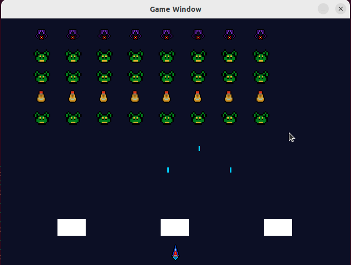
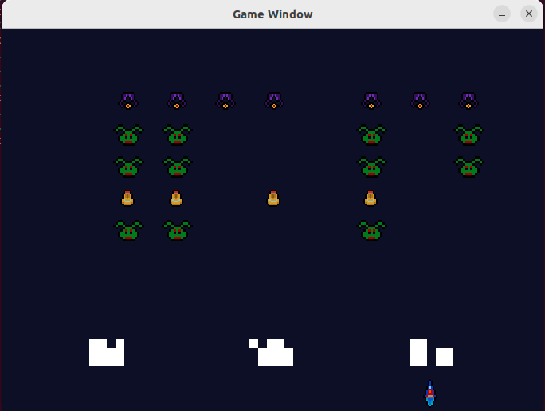

# SpaceInvaders in C

Project for the ProInformatik VII: Introduction to C Programming module. The objective is to develop a project utilizing the knowledge acquired over the past four weeks and present it to the tutors upon completion.

## Table Of Content

- [Course content](#course-content)
- [Grading](#grading)
- [Getting Started](#getting-started)
  - [Dependencies](#dependencies)
  - [Installation](#installation)
  - [Compile and run](#compile-and-run)
- [Example pictures](#example-pictures)
- [Contribution](#contribution)

## Course content

The purpose of this project is to further explore and solidify the concepts learned in the ProInformatik VII: Introduction to C Programming course.

## Grading

| Assignment  | Grade |
| ------------- | ------------- |
| project  | passed  |

## Getting Started 
### Dependencies

In order for the scripts to work you will need the following packages:
 * `libsdl2-image-dev`
 * `libsdl2-mixer-dev`
 * `libdsl2-dev`
 * `libdsl2-2.0-0`

 ### Installation

Installation of the dependencies on ubuntu:
 - `sudo apt install libsdl2-dev libsdl2-2.0-0 libdsl2-mixer-dev libsdl2-image-dev -y;`

Cloning the repo:
 - `git clone https://github.com/thob97/PIA-openvpn-qbittorrent-port-forward-script.git`

 ### Compile and run
 - `cc -o spaceinvader main.c -lSDL2 -lSDL2_image -lSDL2_mixer`
 - `./spaceinvader`

## Example pictures

    
    

## Contribution

* Thore Brehmer - projekt task: elemental functions: "engine", controlls, ...
* Jonny Lam - projekt task: music + sound effects
